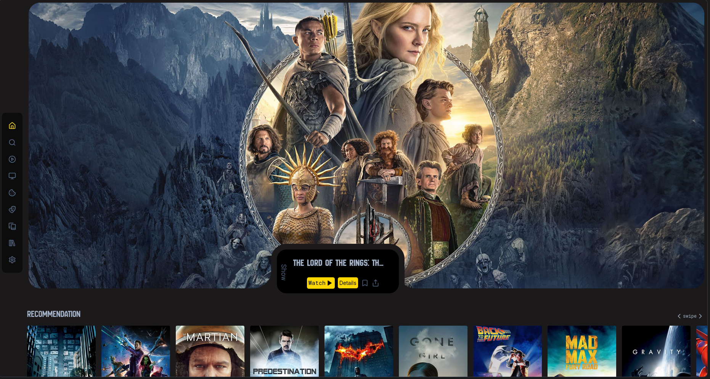
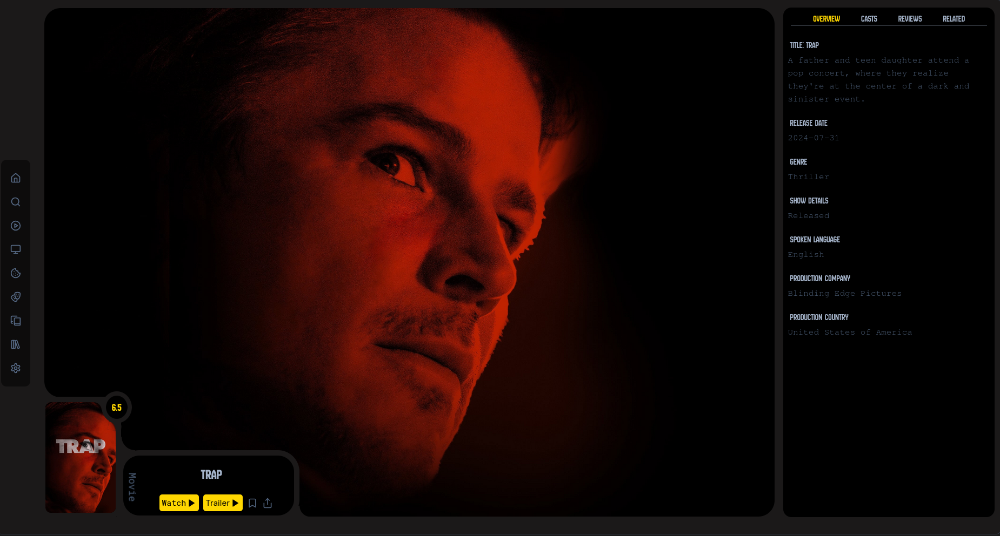

# WebCinema

Welcome to **WebCinema**, a comprehensive Next.js application where you can find all types of watching content including movies, TV shows, anime, and K-dramas. The application leverages the power of the TMDB API to provide users with a seamless experience in discovering and exploring various forms of entertainment.

## Features

- **Dynamic Content:** Easily explore different categories like movies, TV shows, anime, and K-dramas.
- **Responsive Design:** Fully responsive layout ensuring a smooth user experience across devices.
- **Minimalistic & Aesthetic UI:** A clean and minimal design focused on content delivery.
- **Detailed Information:** View detailed information about each movie, show, or anime, including cast, reviews, and related content.
- **Search Functionality:** Search for specific titles with results sorted by popularity.
- **Shimmer Effect:** Enhanced user experience with loading shimmer animations.

Screenshots

Below are the screenshots of the WebCinema application:
  

Movie details section of WebCinema
Tech Stack

    Framework: Next.js
    Styling: Tailwind CSS
    API: TMDB API
    State Management: React Hook Form with Zod for form validation
    Animations: Keen Slider

Contact

Rohit - rohitjaatjaat073@gmail.com

Project Link: https://github.com/WasATrueWarrior/webcinema
